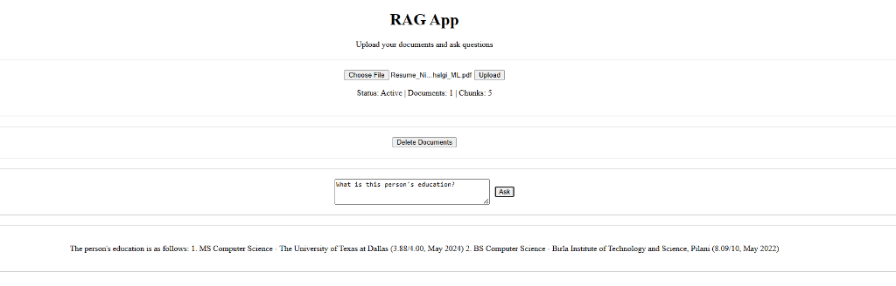

## Local RAG System

A personal Documention Question Answering System. 

## Features

- PDF and Text file processing
- Document chunking
- Vector store creation
- Question answering with source documents
- Statistics about loaded documents




## Prerequisites

1. Install [Ollama](https://ollama.com).
2. Pull the required model:
```bash
ollama pull llama3.2:3b
```

## Installation

Make sure to be in the RAG directory.

```bash
pip install -r requirements.txt
```

## Usage

Start the RAG server (which also serves the frontend):

```bash
python -m uvicorn server.server:app --reload
```

Once the server is running, open your browser and navigate to:
**http://localhost:8000**

For terminal based usage:
```bash
python main.py
```